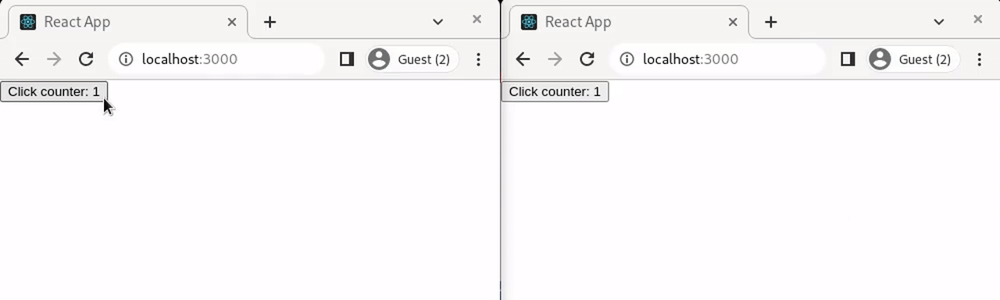

# use-cross-tab-state

A React hook for state synchronization and persistence across multiple browser tabs.

## Usage

```javascript
import { useCrossTabState } from 'use-cross-tab-state';

const App = () => {
  const [counter, setCounter] = useCrossTabState('counter', 1);

  return (
    <button onClick={() => setCounter(counter + 1)}>
      Click counter: {counter}
    </button>
  );
};
```



```javascript
import { useCrossTabState } from 'use-cross-tab-state';

const App = () => {
  const [news, setNews, { useLeader }] = useCrossTabState('news');

  // useLeader is similar to useEffect: the function will re-run when dependencies changed,
  // except it will only run ONCE in leader tab even if multiple tabs exist.
  useLeader(() => {
    // Note: the function will also re-run when current tab becomes leader,
    // so fetch data only if data is not fetched by old leaders yet.
    if (!news) {
      console.log('[Leader] Fetching news...');
      setNews(...);
    }
  }, [news]);
};
```

## API Reference

### useCrossTabState API

```javascript
const [state, setState, results] = useCrossTabState(key, defaultValue, options);
```

<table>
  <tr>
    <td> Option </td>
    <td> Type </td>
    <td> Default Value </td>
    <td> Description </td>
  </tr>
  <tr>
    <td> storage </td>
    <td> Boolean or Object </td>
    <td> undefined </td>
    <td> 
      The state is persistent in local storage if set to <code>true</code>, or an object: <code>{ onSave: (state) => any, onRead: (state) => any }</code>.
    </td>
  </tr>
  <tr>
    <td> checkLeaderInterval </td>
    <td> Number </td>
    <td> 200 </td>
    <td>
      Check if there exists leader for dispatching initial state to current tab every <code>checkLeaderInterval</code> ms. Checking is stopped when a leader is found.
    </td>
  </tr>
</table>

<table>
  <tr>
    <td> Result </td>
    <td> Type </td>
    <td> Description </td>
  </tr>
  <tr>
    <td> useLeader </td>
    <td> Function </td>
    <td>
      Similar to useEffect: the function will re-run when dependencies changed, except it will only run <b>ONCE</b> in leader tab even if multiple tabs exist.
      <br />
      Note: the function will re-run when current tab becomes leader (it may happen when the original leader tab is closed).
    </td>
  </tr>
</table>

## Credits

Special thanks to [@kftsehk](https://github.com/kftsehk) for constructive discussion!
